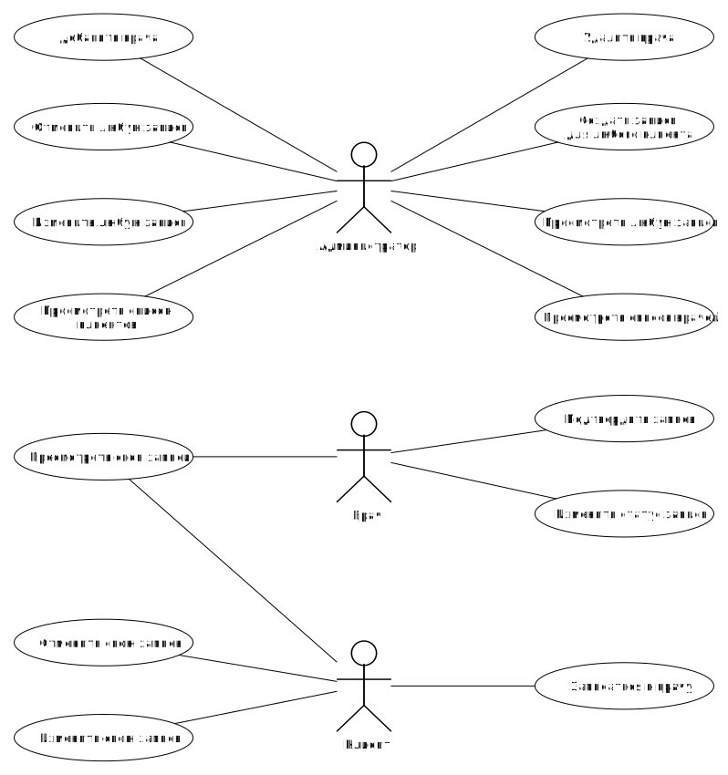

# ЛР1

## Название проекта
DikDoc - веб-приложение сети медицинских клиник

## Краткое описание идеи проекта
Веб-приложение сети медицинских клиник. Сайт предоставляет пользователям возможность записаться на прием к врачу. Клиент клиники может посмотреть список клиник и время своей записи, а также имеет возможность отменить запись к врачу.

## Краткое описание предметной области 
Каждый день тысячи людей сталкиваются с необходимостью записаться на прием к врачу. Это может быть вызвано серьезной травмой, требующей незамедлительного медицинского вмешательства, или же необходимостью пройти профилактическое обследование. Сайт сети DikDoc позволяет пользователям без затруднений записаться на прием к высококвалифицированному врачу, который поможет решить любую проблему, связанную со здоровьем.

## Краткий анализ аналогичных решений по минимум 3 критериям 

Решение                                      | Запись через сайт  | Выбор филиала  | Вызов врача на дом
-------------------------------------------- | ------------------ | -------------- | ----------------------
[Поликлиника.ру](https://polyclinika.ru/)    | -                  | +              | -                      |
[Семейный доктор](https://www.fdoctor.ru)    | -                  | +              | +                      |
[Семейная поликлиника](https://setpol.ru/)	 | -                  | +              | -                      |
Предлагаемое решение                         | +                  | +              | +                      |

## Краткое обоснование целесообразности и актуальности проекта
Из всех представленных в предыдущем пункте аналогичных решений сеть "Семейный доктор" является самой полнофункциональной. Но данная сеть клиник не позволяет пользователю записаться на прием к врачу через сайт без подтверждения записи через оператора. Разрабатываемое решение устраняет недостатки этого сервиса.

## Краткое описание акторов
Роли:
- Клиент - посетитель сайта
- Врач - авторизованный пользователь, который имеет право на подтверждение записи к нему и на изменение ее статуса
- Администратор - авторизованный пользователь, который имеет право на создание, изменение и удаление записей, врачей и клиентов

## Use-Case - диаграмма 

## ER-диаграмма сущностей

## Пользовательские сценарии
1. Сценарий записи на прием
    - пользователь заходит в систему
    - проходит авторизацию
    - нажимает на кнопку "Записаться на прием"
    - вводит свои ФИО и номер телефона, выбирает специальность врача и дату/время приема

2. Сценарий изменения пациентом предстоящего приема
    - пользователь заходит в систему
    - проходит авторизацию
    - нажимает на кнопку "Мои записи"
    - выбирает нужную запись приема
    - редактирует время приема

3. Сценарий просмотра врачом предстоящих приемов
    - врач заходит в систему
    - проходит авторизацию
    - нажимает на кнопку "Мои приемы"

4. Сценарий просмотра администатором списка всех врачей
    - администратор заходит в систему
    - проходит авторизацию
    - нажимает на кнопку "Врачи" 
    - в появившемся меню выбирает нужного врача

## Формализация ключевых бизнес-процессов

# ЛР2

## Тип приложения
Web MPA

## Технологический стек
- Back: Golang + PostgreSQL
- Front: React + TS

## Верхнеуровневое разбиение на компоненты

## Диаграмма классов

# ЛР6

## Уточненное разбиение на компоненты

## Полная диаграмма классов

